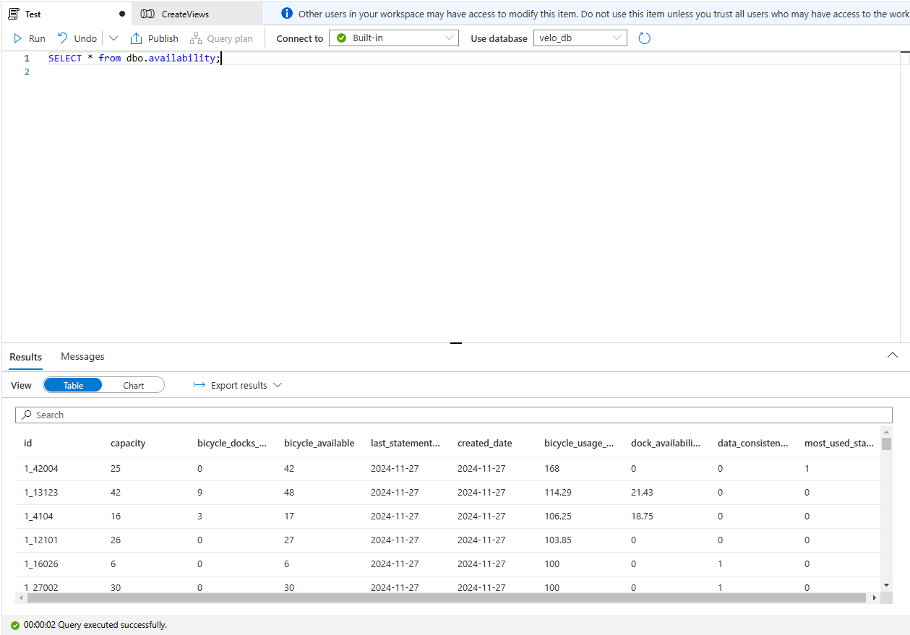

# Construction du pipeline sur Azure (ETL)

## Introduction 

Ce projet étend le pipeline ETL des bornes de vélos en temps réel de Paris en exploitant divers services Azure. L'ingestion des données se fait via Azure Event Hub, leur stockage dans Azure Data Lake, le traitement via Azure Databricks, et l'analyse avec Azure Synapse Analytics. Les données sont enrichies avec une API open-source pour une vue complète de l'utilisation des bornes de vélos.

## Architecture du projet


## Services Azure Utilisés

### 1. **Azure Data Factory**
- **Rôle :** Orchestration et ingestion des données.
- **Utilisation :**
  - Récupération des données depuis l'API de Paris et leur stockage dans le layer Bronze d'Azure Data Lake.
  - Automatisation quotidienne grâce à un trigger basé sur la date.

### 2. **Azure Data Lake Storage Gen2**
- **Rôle :** Stockage des données à chaque étape (Bronze, Silver, Gold).
- **Organisation :**
  - **Bronze :** Données brutes extraites des APIs.
  - **Silver :** Données nettoyées, transformées et organisées (par ville, disponibilité, station).
  - **Gold :** Données enrichies et agrégées, prêtes pour des analyses avancées.

### 3. **Azure Databricks**
- **Rôle :** Transformation des données entre les couches (Bronze -> Silver, Silver -> Gold).
- **Utilisation :**
  - Nettoyage des données.
  - Structuration des données en dossiers logiques.
  - Enrichissement avec des informations supplémentaires comme des horodatages et des formats de données.

### 4. **Azure Synapse Analytics (optionnel)**
- **Rôle :** Analyse SQL sur les données enrichies.
- **Utilisation :** Permet des requêtes rapides sur les données Gold.

### 5. **Azure Key Vault**
- **Rôle :** Sécurisation des secrets et credentials pour accéder aux services et APIs.

---

## Étapes Suivies

### 1. **Ingestion des Données (EXTRACT)**
- **Action :**
  - Création d'un pipeline dans Azure Data Factory pour appeler l'API de Paris.
  - Sauvegarde des données sous forme de fichiers Parquet dans la couche Bronze d'Azure Data Lake.

**Azure Data factory Pipeline , la premiere activité consiste en l'ingestion**


**Bronze  layer content**


**Dedans une date , on trouve le parquet file (raw data)**


### 2. (TRANSFORM)

#### 1. Transformation Bronze to silver

- **Action :**

    - Utilisation de notebooks Databricks pour nettoyer et structurer les données.
    - Organisation des données dans trois sous-dossiers : `availability`, `city`, `station`.
    - Chaque sous-dossier est partitionné par date pour conserver l'historique.

**Interface Databricks contenant nos notebooks**


- **Mounting Azure Data Lake Storage dans Databricks**

Avant de commencer les transformations, il est nécessaire de **monter** les conteneurs d'Azure Data Lake Storage (ADLS) dans Databricks. Cela permet un accès facile aux données directement via les points de montage `/mnt/bronze`, `/mnt/silver`, et `/mnt/gold`.

- **Qu'est-ce que le mounting ?**

Monter un conteneur ADLS signifie créer un lien entre Databricks et les conteneurs de stockage Azure. Cela facilite la lecture et l'écriture des fichiers directement dans ADLS en utilisant des chemins simplifiés.

- **À noter :**

- Cette opération est effectuée **une seule fois** lors de la configuration initiale.
- Une fois montés, les conteneurs restent accessibles pour tous les notebooks Databricks.

- **Code utilisé pour le mounting :**

```python
# Configuration pour se connecter à Azure Data Lake
configs = {
  "fs.azure.account.auth.type": "OAuth",
  "fs.azure.account.oauth.provider.type": "org.apache.hadoop.fs.azurebfs.oauth2.ClientCredsTokenProvider",
  "fs.azure.account.oauth2.client.id": "32ca1c75-31d6-4a94-bad6-f0de42f8ee02",  # Application (client) ID
  "fs.azure.account.oauth2.client.secret": "XXXXXXXXXXXXXXX",  # Client secret Hided it for security 
  "fs.azure.account.oauth2.client.endpoint": "https://login.microsoftonline.com/d40d5b6c-caf9-4d8f-8bf5-6e5da3f9fb5a/oauth2/token"  # Directory (tenant) ID
}

# Monter le conteneur "bronze"
dbutils.fs.mount(
  source = "abfss://bronze@mystorageaccount2312.dfs.core.windows.net/",
  mount_point = "/mnt/bronze",
  extra_configs = configs
)

# Monter le conteneur "silver"
dbutils.fs.mount(
  source = "abfss://silver@mystorageaccount2312.dfs.core.windows.net/",
  mount_point = "/mnt/silver",
  extra_configs = configs
)

# Monter le conteneur "gold"
dbutils.fs.mount(
  source = "abfss://gold@mystorageaccount2312.dfs.core.windows.net/",
  mount_point = "/mnt/gold",
  extra_configs = configs
)
```


#### Pour la consolidation des données de stations voici le contenu du notebook Bronze_to_silver_station

```python
from pyspark.sql import SparkSession
from pyspark.sql.functions import col, lit, to_date, when, concat
from datetime import datetime
import pytz

# Initialize Spark session
spark = SparkSession.builder.appName("StationDataTransformation").getOrCreate()

# Define paths and today's date
bronze_base_path = "/mnt/bronze"
silver_base_path = "/mnt/silver/stationdata"
# Set the timezone to Paris
paris_timezone = pytz.timezone("Europe/Paris")

# Get the current date and time in the Paris timezone
paris_time = datetime.now(paris_timezone)

# Format the date
today_date = paris_time.strftime("%Y-%m-%d")
# Define paths for today
today_bronze_folder = f"{bronze_base_path}/{today_date}"
silver_output_path = f"{silver_base_path}/{today_date}_station.parquet"

# Define Paris city code
PARIS_CITY_CODE = "1"

try:
    # Load today's data from the Bronze layer
    station_data = spark.read.parquet(today_bronze_folder)
    print(f"Successfully loaded data from {today_bronze_folder}")

    # Select relevant columns and perform transformations
    transformed_data = station_data.select(
        col("stationcode").alias("code"),
        col("name").alias("name"),
        col("nom_arrondissement_communes").alias("city_name"),
        col("code_insee_commune").alias("city_code"),
        col("capacity").alias("capacity"),
        to_date(col("duedate")).alias("updated_date"),  # Rename duedate to updated_date
        lit(today_date).alias("created_date"),  # Add today's date as created_date
        when(col("is_installed") == "OUI", 1).otherwise(0).alias("status"),  # Encode status as 1/0
        when(col("is_renting") == "OUI", 1).otherwise(0).alias("is_renting"),  # Encode is_renting as 1/0
        when(col("is_returning") == "OUI", 1).otherwise(0).alias("is_returning"),  # Encode is_returning as 1/0
    ).withColumn(
        "id", concat(lit(PARIS_CITY_CODE), lit("-"), col("code"))  # Add unique ID combining Paris city code and station code
    )

    # Reorder columns to move 'id' to the beginning
    reordered_columns = [
        "id", "code", "name", "city_name", "city_code", 
        "capacity", "updated_date", "created_date", "status", "is_renting", "is_returning"
    ]
    transformed_data = transformed_data.select(*reordered_columns)

    # Write the transformed data to the Silver layer
    transformed_data.write.mode("overwrite").parquet(silver_output_path)
    print(f"Data successfully saved to {silver_output_path}")

    # Load and display the transformed data from Silver
    print("Loading data from Silver layer for verification...")
    silver_data = spark.read.parquet(silver_output_path)
    print(f"Successfully loaded data from {silver_output_path}")
    
    # Display the data
    display(silver_data)

except Exception as e:
    print(f"Error processing station data: {e}")
    raise
```


#### Explication

Ce code Python utilise **PySpark** pour effectuer les étapes suivantes :

**Initialisation :**
- Une session Spark est créée pour gérer le traitement des données.
- Les chemins pour les couches Bronze et Silver sont définis.

**Chargement des données :**
- Les données du jour (par date) sont récupérées depuis la couche Bronze sous forme de fichiers Parquet.

**Transformation des données :**
- Les colonnes sont renommées et transformées pour répondre aux besoins métiers :
  - Exemple : Le champ `is_installed` est encodé en binaire (1 pour "OUI", 0 sinon).
- Une colonne unique `id` est créée en combinant le code de la ville de Paris avec le code de la station.

**Écriture dans la couche Silver :**
- Les données transformées sont enregistrées sous forme de fichiers Parquet dans la couche Silver, organisées par date.

**Chargement et vérification :**
- Les données écrites dans Silver sont rechargées pour vérifier leur intégrité.


#### Pour la consolidation des données d'availability  voici le contenu du notebook Bronze_to_silver_availability

```python

from datetime import datetime
import os
from pyspark.sql import SparkSession
from pyspark.sql.functions import col, lit, to_date, concat, round
import pytz

# Initialize Spark session
spark = SparkSession.builder.appName("ConsolidateAvailabilityData").getOrCreate()

# Define paths
bronze_base_path = "/mnt/bronze"
silver_base_path = "/mnt/silver"
# Set the timezone to Paris
paris_timezone = pytz.timezone("Europe/Paris")

# Get the current date and time in the Paris timezone
paris_time = datetime.now(paris_timezone)

# Format the date
today_date = paris_time.strftime("%Y-%m-%d")
bronze_folder_path = f"{bronze_base_path}/{today_date}"
silver_availability_path = f"{silver_base_path}/availability/{today_date}_availability.parquet"

# Load today's data from the bronze layer
try:
    availability_data = spark.read.parquet(bronze_folder_path)
    print(f"Successfully loaded data from: {bronze_folder_path}")
except Exception as e:
    print(f"Error loading data from: {bronze_folder_path}")
    raise e

# Process and transform the data
availability_data = (
    availability_data
    .withColumn("id", concat(lit("1_"), col("stationcode")))  # Add unique ID as "1_Stationcode"
    .withColumnRenamed("numdocksavailable", "bicycle_docks_available")
    .withColumnRenamed("numbikesavailable", "bicycle_available")
    .withColumn("last_statement_date", to_date(col("duedate")))  # Convert duedate to a proper date
    .withColumn("created_date", lit(today_date))  # Add the created_date column with today's date
    .select(
        "id",
        "capacity",
        "bicycle_docks_available",
        "bicycle_available",
        "last_statement_date",
        "created_date"
    )  # Select relevant columns
)

# Write the transformed data to the silver layer
try:
    availability_data.write.mode("overwrite").parquet(silver_availability_path)
    print(f"Data successfully written to: {silver_availability_path}")
except Exception as e:
    print(f"Error writing data to: {silver_availability_path}")
    raise e

# Display the processed data for verification
display(availability_data)
```

#### Explication

Ce code Python utilise **PySpark** pour transformer les données de disponibilité (availability) de la couche Bronze vers la couche Silver. Voici les étapes principales :

**Initialisation :**
- Une session Spark est créée pour le traitement des données.
- Les chemins pour les couches Bronze (`bronze_base_path`) et Silver (`silver_base_path`) sont définis.
- Le fuseau horaire est configuré pour Paris, et la date actuelle est obtenue pour créer des partitions et nommer les fichiers.

**Chargement des données :**
- Les données du jour sont récupérées depuis la couche Bronze en lisant les fichiers Parquet.
- Une vérification est effectuée pour s'assurer que les données sont chargées correctement.

**Transformation des données :**
- Ajout d'une colonne `id` unique basée sur le code de la station (`stationcode`), préfixée par `1_`.
- Renommage des colonnes pour des noms plus explicites :
  - `numdocksavailable` devient `bicycle_docks_available`.
  - `numbikesavailable` devient `bicycle_available`.
- Conversion de la colonne `duedate` en un format de date approprié (`last_statement_date`).
- Ajout d'une colonne `created_date` contenant la date du jour.
- Sélection des colonnes pertinentes pour simplifier la structure des données :
  - `id`, `capacity`, `bicycle_docks_available`, `bicycle_available`, `last_statement_date`, et `created_date`.

**Écriture des données dans la couche Silver :**
- Les données transformées sont enregistrées dans la couche Silver sous forme de fichiers Parquet.
- La structure des dossiers dans Silver inclut le répertoire `availability`, avec un fichier nommé selon la date du jour (par exemple, `2024-12-13_availability.parquet`).

**Vérification :**
- Les données transformées sont affichées dans Databricks pour une vérification manuelle de leur intégrité.

**Silver Folders**


**Silver SubFolders**


#### 2. **Transformation Silver -> Gold**

- **Action :**
  - Application de transformations supplémentaires dans Databricks pour enrichir les données.
  - Organisation en dossiers Gold prêts pour l'analyse.

#### Pour l'aggrégation des données d'availibality , voici le contenu du notebook `Silver_to_gold_Availability`

```python
from datetime import datetime
import pytz
from pyspark.sql import SparkSession
from pyspark.sql.functions import col, lit, round, desc, row_number, when
from pyspark.sql.window import Window

# Initialize Spark session
spark = SparkSession.builder.appName("AvailabilityDataTransform").getOrCreate()

# Define paths
silver_base_path = "/mnt/silver"
gold_base_path = "/mnt/gold"

# Set the timezone to Paris
paris_timezone = pytz.timezone("Europe/Paris")

# Get the current date in Paris timezone
paris_time = datetime.now(paris_timezone)
today_date = paris_time.strftime("%Y-%m-%d")

# Define input and output paths
silver_availability_path = f"{silver_base_path}/availability/{today_date}_availability.parquet"
gold_availability_path = f"{gold_base_path}/{today_date}/availability"

# Load the availability data from the silver layer
try:
    availability_df = spark.read.parquet(silver_availability_path)
    print(f"Successfully loaded data from: {silver_availability_path}")
except Exception as e:
    print(f"Error loading data from: {silver_availability_path}")
    raise e

# Transformation: Add new columns
transformed_df = (
    availability_df
    .withColumn("bicycle_usage_rate", 
                round((col("bicycle_available") / col("capacity")) * 100, 2))  # % of bikes available
    .withColumn("dock_availability_rate", 
                round((col("bicycle_docks_available") / col("capacity")) * 100, 2))  # % of docks available
    .withColumn("data_consistency_flag", 
                when(col("capacity") == col("bicycle_docks_available") + col("bicycle_available"), 1)
                .otherwise(0))  # Flag for consistent data (1: equal, 0: not equal)
)

# Find the most-used station (by usage rate) and flag it
window_spec = Window.orderBy(desc("bicycle_usage_rate"))
transformed_df = (
    transformed_df
    .withColumn("rank", row_number().over(window_spec))
    .withColumn("most_used_station", when(col("rank") == 1, 1).otherwise(0))  # 1 for most-used station, 0 otherwise
    .drop("rank")  # Drop the rank column
)

# Write the transformed data to the gold layer in Delta format
try:
    transformed_df.write.format("delta").mode("overwrite").option("mergeSchema", "true").save(gold_availability_path)
    print(f"Data successfully written to: {gold_availability_path}")
except Exception as e:
    print(f"Error writing data to: {gold_availability_path}")
    raise e

# Display the transformed data
display(transformed_df)
```

#### Explication : Transformation des données de disponibilité (Silver -> Gold)

Ce script Python utilise **PySpark** pour transformer et enrichir les données de disponibilité de la couche Silver vers la couche Gold. Voici les étapes détaillées :

---

**1. Initialisation**
- Une **session Spark** est créée pour effectuer les transformations nécessaires.
- Le fuseau horaire est défini pour **Paris**, et la date actuelle est récupérée pour générer des chemins dynamiques basés sur la date.
- Les chemins pour :
  - Charger les données depuis la couche Silver : `/mnt/silver/availability/{date}_availability.parquet`.
  - Sauvegarder les données transformées dans la couche Gold : `/mnt/gold/{date}/availability`.

---

**2. Chargement des données**
- Les données de disponibilité du jour sont chargées depuis la couche Silver au format **Parquet**.
- Une gestion des erreurs est implémentée pour garantir que les données sont correctement chargées.

---

**3. Transformation des données**
- **a) Ajout de nouvelles colonnes calculées**
1. **`bicycle_usage_rate`** : Calcul du pourcentage d'utilisation des vélos par rapport à la capacité totale :
   \[
   \text{bicycle\_usage\_rate} = \frac{\text{bicycle\_available}}{\text{capacity}} \times 100
   \]
2. **`dock_availability_rate`** : Calcul du pourcentage de disponibilité des docks par rapport à la capacité totale :
   \[
   \text{dock\_availability\_rate} = \frac{\text{bicycle\_docks\_available}}{\text{capacity}} \times 100
   \]
3. **`data_consistency_flag`** : Indicateur binaire pour vérifier la cohérence des données :
   - Valeur `1` si :
     \[
     \text{capacity} = \text{bicycle\_available} + \text{bicycle\_docks\_available}
     \]
   - Sinon, valeur `0`.

- **b) Identification de la station la plus utilisée**
- Une **fenêtre Spark** est utilisée pour trier les stations par leur taux d'utilisation (`bicycle_usage_rate`) en ordre décroissant.
- Une nouvelle colonne **`most_used_station`** est ajoutée pour marquer la station ayant le taux d'utilisation le plus élevé :
  - `1` pour la station la plus utilisée.
  - `0` pour les autres stations.

---

**4. Écriture dans la couche Gold**
- Les données transformées sont sauvegardées dans la couche Gold au format **Delta** :
  - Mode `overwrite` : Les données existantes pour la date en cours sont écrasées.
  - Option `mergeSchema` : Permet de gérer les éventuelles modifications dans le schéma des données.

---

**5. Vérification**
- Les données transformées sont affichées dans Databricks pour valider :
  - Les calculs (`bicycle_usage_rate`, `dock_availability_rate`).
  - La cohérence des données (`data_consistency_flag`).
  - L'indicateur de la station la plus utilisée (`most_used_station`).

---

**Résultat attendu**
Après transformation, la couche Gold contiendra les colonnes suivantes :
1. **`id`** : Identifiant unique de la station.
2. **`capacity`** : Capacité totale de la station.
3. **`bicycle_docks_available`** : Nombre de docks disponibles.
4. **`bicycle_available`** : Nombre de vélos disponibles.
5. **`bicycle_usage_rate`** : Taux d'utilisation des vélos (en pourcentage).
6. **`dock_availability_rate`** : Taux de disponibilité des docks (en pourcentage).
7. **`data_consistency_flag`** : Indicateur de cohérence des données (`1` ou `0`).
8. **`most_used_station`** : Indicateur de la station la plus utilisée (`1` ou `0`).

---

**Gold Container**


**The content of every folder in the container**


### 3. (LOAD) Création des tables sur Azure Synapse


#### Objectif
Après avoir effectué les étapes d'extraction et de transformation des données, je passe maintenant à la phase de **Load**, où les données de la couche **Gold** sont utilisées pour créer les **tables de dimension** et les **tables de fait** dans **Azure Synapse Analytics**. Ces tables seront ensuite connectées à Power BI pour permettre des analyses et des visualisations interactives.

---

#### Déclenchement de la pipeline sur Synapse
Dès que les données sont disponibles dans la couche **Gold**, une **pipeline Azure Synapse** est déclenchée automatiquement pour gérer la création ou la modification des **vues nécessaires**. 

---


#### Explication des activités dans la pipeline

1. **Récupération des noms des tables**
   - La première activité, `Get Metadata`, a pour but de récupérer les noms des sous-dossiers dans chaque dossier Gold (disponibilité, stations, villes). Ces sous-dossiers représentent les **noms des tables** que je dois créer dans Synapse :
     - **`availability`**
     - **`station`**
     - **`city`**
   - Ces noms sont dérivés directement de la structure de la couche Gold, où chaque dossier par date contient ces trois sous-dossiers.

2. **Application d'une procédure stockée pour chaque table**
   - Une fois les noms des tables récupérés, une boucle `ForEach` est utilisée pour parcourir chaque table identifiée (subfolder).
   - Pour chaque table, une **stored procedure** est appelée pour créer ou modifier la table correspondante dans Synapse :
     - **Dimension Tables** : Tables décrivant les entités (stations, villes).
     - **Fact Tables** : Tables contenant les mesures liées à la disponibilité des vélos.
   - Cette approche permet une automatisation complète et garantit que les tables sont toujours synchronisées avec les données disponibles dans Gold.

---

- **Une fois la pipeline exécutée, je trouve mes views dans ma SQL database sur Synapse**


- **Voici le résultat d'une simple query sur Synapse**




### 4. Déclenchement des pipelines

J'ai configuré un **schedule** pour la **pipeline Azure Data Factory** afin qu’elle s’exécute **chaque jour à 21h (9PM)**. Cette pipeline permet de :

- **Récupérer les données du jour** à partir des sources (API, etc.).
- **Appliquer les transformations nécessaires** pour les nettoyer et les structurer.
- **Déposer les données transformées dans la couche Gold** du Data Lake.

---

### Pipeline Azure Synapse

- Une fois les données du jour disponibles dans la couche Gold, la **pipeline Azure Synapse** est déclenchée.
- Cette pipeline récupère les données du dernier jour et les ajoute aux **tables existantes** dans Synapse. Cela garantit :
  - La conservation d'un **historique complet** des données.
  - Une préparation optimale des données pour des analyses et visualisations dans Power BI.


---

## Je n'ai pas pu visualiser les données
L'instance Power BI n'était pas accessible avec le compte utilisé pour travailler sur Azure, ce qui m'a empêché de visualiser les données.

Pour toute question ou demande d'information complémentaire, n'hésitez pas à me contacter à l'adresse suivante : enna.mohamed02@gmail.com


